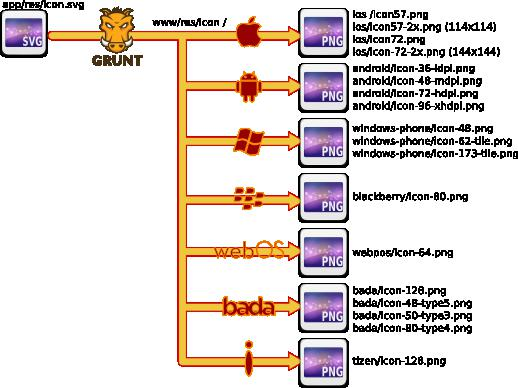

# grunt-svg2storeicons
Create icons for mobile and tablet applications for all stores icons from a simple squared SVG.



## Getting Started
### GraphicsMagick
This plugin requires GraphicsMagick.

If you are on OSX, use HomeBrew:
```
brew install graphicsmagick
```

If you are on Ubuntu:
```
sudo apt-get install graphicsmagick
```

### Grunt
This plugin requires Grunt `~0.4.2`

If you haven't used [Grunt](http://gruntjs.com/) before, be sure to check out the [Getting Started](http://gruntjs.com/getting-started) guide, as it explains how to create a [Gruntfile](http://gruntjs.com/sample-gruntfile) as well as install and use Grunt plugins. Once you're familiar with that process, you may install this plugin with this command:

```shell
npm install grunt-svg2storeicons --save-dev
```

Once the plugin has been installed, it may be enabled inside your Gruntfile with this line of JavaScript:

```js
grunt.loadNpmTasks('grunt-svg2storeicons');
```

## The "svg2storeicons" task
### Overview
In your project's Gruntfile, add a section named `svg2storeicons` to the data object passed into `grunt.initConfig()`.

```js
grunt.initConfig({
  svg2storeicons: {
    your_target: {
      // Source file: the SVG.
      src: 'app/res/icon.svg',
      // Destination directory where are stored all app icons
      dest: 'www/res/icon',
      // Optionnal, it produces icons for every stores if not specified
      options: {
        // A  list of stores
        profiles: ['windows-phone', 'android']
      }
    },
  },
});
```

### Options
#### options.profiles
Type: `Array of String`
Default value: `['ios', 'android', 'windows-phone', 'blackberry', 'webos', 'bada', 'tizen']`

Specify the stores that you target. The full list is provided as default.

### Usage Examples
#### Default Options
In this example, the default options are used. Icons for all sizes of phones are being produced for each stores. The `src` contains the access to an squared SVG file. The `dest` contains the directory in which the icons are produced.
```js
grunt.initConfig({
  svg2storeicons: {
    all_stores: {
      src: 'app/res/icon.svg',
      dest: 'www/res/icon'
    }
  }
});
```

#### Custom Options
In this example, custom options are used to only target Android and iOS.
```js
grunt.initConfig({
  svg2storeicons: {
    google_play_and_app_store: {
      src: 'app/res/icon.svg',
      dest: 'www/res/icon',
      options: {
        profiles: ['android', 'ios']
      }
    }
  }
});
```

## Contributing
The main plugin is written and its tests are written in CoffeeScript. In lieu of a formal styleguide, take care to maintain the existing coding style. Add unit tests for any new or changed functionality. Lint and test your code using [Grunt](http://gruntjs.com/). Feel free to contribute.

## Release History
* 0.1.1: 12/25/2013: PR on node-gm for transparent background: PEM--
* 0.1.0: 12/24/2013: Initial commit: PEM--

## Known issue
* Tests needs to be done.
